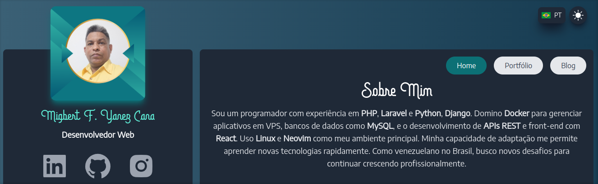

# 

## 🌟 Mi Portafolio Web

Bienvenido a mi portafolio web, donde muestro mis proyectos, habilidades y experiencia como desarrollador. Aquí encontrarás ejemplos de mi trabajo con tecnologías modernas y un vistazo a mi enfoque profesional.  

Soy un programador con experiencia en **PHP, Laravel, Python y Django**. Domino **Docker** para gestionar aplicaciones en VPS, bases de datos como **MySQL**, y el desarrollo de **APIs REST** y front-end con **React**. Uso **Linux y Neovim** como entorno principal, lo que refleja mi preferencia por herramientas rápidas y personalizables.  
Mi capacidad de adaptación me permite aprender rápidamente nuevas tecnologías. Como venezolano en Brasil, estoy en constante búsqueda de nuevos desafíos para seguir creciendo profesionalmente.

---

## ⚙️ Tecnologías utilizadas en este portafolio

- **Frontend**: Livewire, Alpine.js, TailwindCSS, Vite.
- **Backend**: PHP (Laravel).
- **Infraestructura**: Docker, Servidor VPS.
- **Otros**: MySQL, Font Awesome, Neovim.

---

## 🖼️ Vista previa del proyecto

Puedes visitar el portafolio aquí: [migbertweb.site](https://migbertweb.site)  
O ver el código fuente en este repositorio.

---

## 📧 Contacto

Si te interesa trabajar conmigo o necesitas más información, no dudes en contactarme:

- **Email**: [migbert.yanez@gmail.com](mailto:migbert.yanez@gmail.com)  
- **Email**: [migbertyanez@disroot.org](mailto:migbertyanez@disroot.org)  
- **LinkedIn**: [MigbertYanez](https://www.linkedin.com/in/migbert-yanez-cana)
